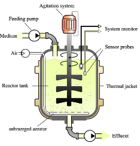
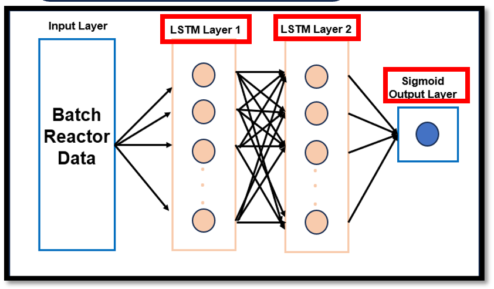
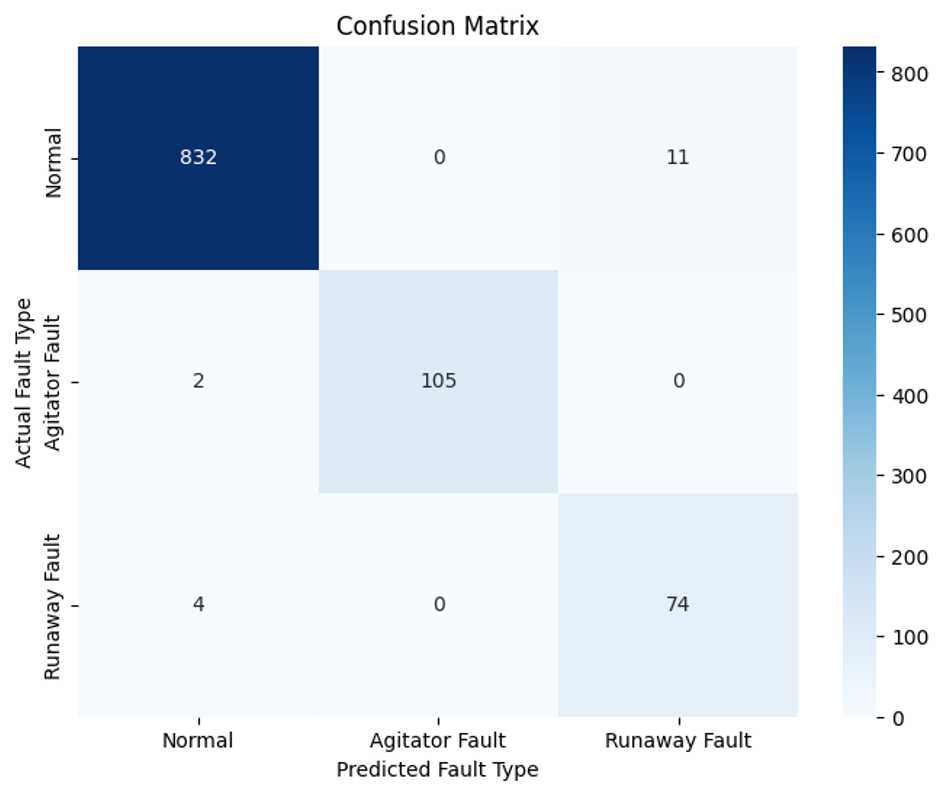
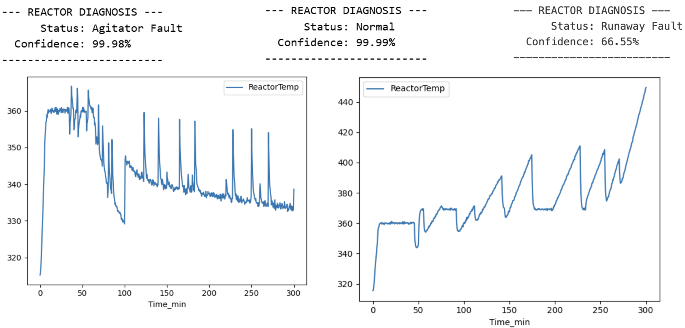

# Process Monitoring and Fault Diagnosis with LSTMs(Long Short-Term Memory) in Batch Reactor


This project develops an intelligent monitoring framework using Artificial Neural Networks (ANN)—specifically Long Short-Term Memory (LSTM) networks—to detect these faults in real-time, moving from simple alarm systems to predictive diagnosis.

## 📌 Project Overview

Batch reactors are critical vessels in the chemical industry where reactions are completed in a single batch. However, they are highly vulnerable to operational faults such as Thermal Runaway, Agitator Malfunction, and sensor anomalies. These faults can cascade, leading to severe safety risks, financial loss, and incomplete conversion.



## 🎯 Objectives

**Develop a Monitoring Framework**: Create a robust system for continuous process monitoring.

**Fault Detection**: Specifically detect Agitator Failure and Thermal Runaway events.

**Validation**: Validate model performance using diverse reactor datasets to ensure high accuracy.

## 🧪 Case Study: Nitration of Benzene

The project focuses on the Nitration of Benzene, a highly exothermic reaction where thermal control is paramount.

**Risk**: Accumulation of unreacted chemicals can act like a "bomb," leading to explosions if cooling fails.

**Challenge**: Traditional Statistical Process Control (SPC) methods are often unreliable for such dynamic, non-linear batch processes.

## ⚙️ Methodology

#### 1. Data Collection & Labeling

Dataset: Aggregated from 9 batch simulation files (7 Normal operation, 2 Faulty operation).

Labels: Data points were precisely labeled into three categories:

```Normal```

```Agitator Fault```

```Runaway Fault```

#### 2. Preprocessing

**Scaling**: All sensor data (Temperature, Pressure, Flow Rates, etc.) was normalized to a 0-1 range.

**Sequence Creation**: Utilized a "sliding window" technique to convert time-series data into sequential clips, allowing the model to learn temporal dynamics.

#### 3. Model Architecture: LSTM

We utilized a multi-layered Long Short-Term Memory (LSTM) network. LSTMs are specifically designed to learn from sequences and time-series data, making them ideal for identifying trends leading up to a fault.



**Input Layer**: Batch Reactor Sensor Data

**Hidden Layers**: LSTM Layers + Dropout (to prevent overfitting)

**Output Layer**: Dense Layer with Sigmoid/Softmax activation for classification.

## 📊 Results & Performance

The model was trained on 80% of the data and validated on 20% unseen data.

|Metric|Value|
|-----|-----|
|Test Accuracy|98.35%|
|Test Loss|0.0744|
|F1 Score|0.9837|

### Confusion Matrix Analysis



The model demonstrated excellent distinction between states:

Runaway Faults: Correctly identified 74 out of 78 instances.

Agitator Faults: Correctly identified 105 instances.

Reliability: The model never confused an Agitator Fault with a Runaway Fault.

## 🌟 Significance

Reduced False Alarms: By understanding the context of the process data, the model dramatically reduces false positives compared to traditional threshold alarms.

Scalability: The methodology is generalizable and can be adapted for other reactor types like CSTRs (Continuous Stirred-Tank Reactors) using transfer learning.

Autonomous Safety: Paves the way for fully autonomous systems that can not only detect faults but potentially intervene to prevent accidents.

## 📂 Repository Structure

```bash
project-root/
│
├── data/                        # Processed datasets ready for AI
│   ├── masterset.csv
│   └── mastersetTL.csv          # Transfer Learning dataset
│
├── models/                      # Saved "Brains" of the AI
│   └── reactor_fault_detector1.h5
│
├── pkl/                         # Saved tools for data cleaning
│   └── preprocessor.pkl
│
├── raw/                         # Original, raw simulation files
│   ├── faults/                  # Data where things went wrong
│   ├── normal/                  # Data where things went right
│   ├── test/                    # Unseen data for testing
│   └── Transferlearning/        # Data for CSTR/PFR adaptation
│
├── simulation/                  # The "Virtual Reactor" (Data Generators)
│   ├── simdata/                 # Temp folder for simulation outputs
│   ├── datapreprocess.py        # Scripts to clean simulation data
│   ├── fischersim.py            # The physics equations of the reactor
│   ├── genfault.py              # Script that purposely breaks the reactor
│   └── simulation.py            # Main script to run the simulation
│
├── src/                         # Source Code (The Logic)
│   ├── __pycache__/             # Python system files (ignore these)
│   ├── faultpred.py             # Uses the model to predict faults
│   ├── load_and_label.py        # Organizes raw data into categories
│   ├── modeltraining.py         # The "Teacher" script (trains the AI)
│   ├── monitoring_faultdetection.py # Live monitoring script
│   └── preprocess.py            # Data scaling and windowing logic
│
├── visualization/               # Charts and Graphs
│   └── graphs.ipynb             # Notebook for plotting results
│
├── .gitignore                   # Tells Git which files to ignore
├── LICENSE                      # MIT License file
├── playbook.ipynb               # Interactive notebook for experiments
├── README.md                    # Project documentation
└── work.ipynb                   # Scratchpad notebook
```
## 🚀 Getting Started
### 1. Prerequisites
Before you begin, make sure you have the following installed on your computer:

Python (3.8 or higher): Ideally, use an environment manager like Anaconda or Miniconda.

Git: To clone the repository.

### 2. Installation
Clone the Repository: Open your terminal or command prompt and run:
```bash
git clone https://github.com/captainKLSH/predictiveModelling-and-faultDetection-in-batchReactors-using-ML.git
cd predictiveModelling-and-faultDetection-in-batchReactors-using-ML
```
### 3. Running the Project
You can run the project in three main stages: Simulate, Train, and Monitor.
``` bash
python simulation/simulation.py
python src/modeltraining.py
python src/monitoring_faultdetection.py
```
### 4. 🧪 For Experimentation (Optional)
If you want to play around with the code and visualize graphs, open the Jupyter Notebooks:
```playbook.ipynb```: A playground for testing different model settings.



```visualization/graphs.ipynb```: Use this to generate the accuracy and loss charts seen in the results section.


## 🔗 Repository

Codebase: [PredictiveModelling-and-faultDetection-in-batchReactors-using-ML](https://github.com/captainKLSH/predictiveModelling-and-faultDetection-in-batchReactors-using-ML)
